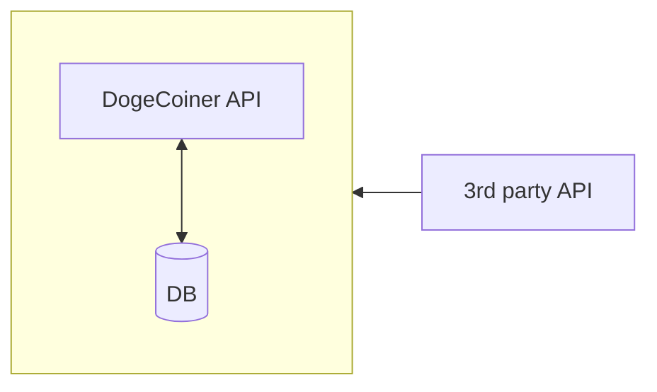

This is Visual Studio solution written in C#.

## Getting Started

To set up a dev environment,

- set up the [DogeCoinerDB](https://github.com/abardandev/dogecoiner-db)
- open the `DogeCoiner.DataImport` solution
- seed the database
  - run unit tests: `DogeCoiner.Data.DAL.Tests.KLineRepoTests`
- set the `DogeCoiner.Data.WebApi` as the startup project
- start a debug session
- find and open the file `DogeCoiner.Data.WebApi.http`
- test the setup by sending some requests
- finally, run all unit tests and ensure they're all green

## Overview

The `DogeCoiner.DataImport` solution covers multiple functions.

1. To import 3rd party price data for multiple assets.
1. To provide structured data access through DogeCoiner API to the DogeCoiner app ecosystem.

The data import has this main use case:
- **Run background workers to get crypto prices and save them to the DogeCoiner database.**

Data import needs to request data on multiple timeframes: weekly, daily, real-time.

> [!NOTE]
> I'll eventually set up Hangfire for this.
>
> So far, this is done manually through a number of unit tests that 1) query weekly and daily data, 2) generate json files, and 3) seed the database with data updates.

Weekly and daily data can be requested on a schedule after 00:00 UTC. Basic portfolio charting doesn't really need more than daily granularity. This is ideal for keeping the system design simple.

Maybe hourly granularity can be good for viewing daily portfolio charts.

Real-time prices allow for a more engaging experience when viewing porfolios. End users may likely consider this a desirable basic feature. This granularity is actually pretty complex since it doesn't serve much use past 'now', meaning this data quickly becomes stale if I don't use it for any kind of granular aggregation or analysis. So, adding real-time features requires extra care for storage, periodic removal and portfolio computation. 

I should also store aggregated portfolio data and not trigger any heavy portfolio computations when incorporating real-time deltas to datasets.

## Solution Projects

### DogeCoiner.Data

_Shared lib for common data types._

### DogeCoiner.Data.Bitunix + Tests

_A service library for configuring and calling the Bitunix exchange public api_

The main utility is the `BitunixDataClient`

### DogeCoiner.Data.Import + Tests

_The main job runner library for importing data from 3rd party apis._

WIP - nothing here yet.

### DogeCoiner.Data.DAL + Tests

_The DAL library for accessing the DogeCoiner database._

The main utilities are `CoinDataDbContext` and Repositories like `KLineRepo`

Using **CQRS**, I've split CRUD operations this way:
- **Create, Update, Delete** - are done through entity Repos like `KLineRepo`
  - using Dapper to call Stored Procedures executing `MERGE` and `DELETE`, 
  - with User-Defined Table Types parameters for batching and set operations.
  - I've opted for this more manual boilerplate process to avoid bad EF code for bulk processing and to let the db do what it's best at.
  - Once this is set up for new entities, performance concerns are trivial, and this code changes much less often than query code.
- **Read** - is done through `CoinDataDbContext` so queries can be highly customizable for most dev use cases.
  - Reading is usually the most complex aspect of CQRS, so keeping dev simpler with a `DbContext` is good when possible.
  - Any special performance optimized querying can be done using Dapper and Stored Procs when the need arises. 
  - You can also always resort to good SQL Procs to avoid any strange EF performance bottlenecks.

### DogeCoiner.Data.WebApi

_The Asp.Net API that serves the DogeCoiner app ecosystem._

Explore available endpoints in this file: `DogeCoiner.Data.WebApi.http`